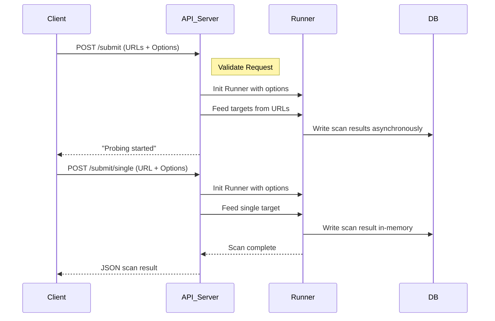

# API Usage & SDK Examples

Explore practical usage examples to help you quickly onboard with gowitness's core scanning APIs. This page focuses on submitting scan requests—both batch and single URL—and retrieving scan results, complete with example requests, responses, and code snippets. These examples illustrate common tasks such as submitting scans, customizing options, and automating workflows through the API.

---

## Overview

gowitness exposes powerful RESTful API endpoints designed for seamless integration into your automation pipelines or custom tooling. This page guides you through real-world interaction patterns with the API, focusing on the most common and important endpoints:

- **Submit Scan Requests**: Submit one or multiple URLs for scanning.
- **Submit Single URL and Receive Synchronous Results**: Run a scan and get immediate feedback.

These flows are designed to help you start scans programmatically and easily integrate gowitness into your security workflows.

<Check>

- All example requests include required headers and accept JSON bodies.
- Outputs are provided in JSON, suitable for parsing and reporting.
- Authentication and authorization are assumed to be managed externally (see the Authentication documentation).

</Check>

---

## 1. Submitting Multiple URLs for Scanning

Use the `/submit` endpoint to start asynchronous scans on multiple URLs. This endpoint accepts a list of URLs and optional parameters to customize scanning options such as browser window size, user-agent string, timeout, delay, and screenshot format.

### Endpoint

```
POST /submit
Content-Type: application/json
```

### Request Payload

```json
{
  "urls": ["https://example.com", "https://example.org"],
  "options": {
    "window_x": 1920,
    "window_y": 1080,
    "user_agent": "CustomUserAgent/1.0",
    "timeout": 30,
    "delay": 2,
    "format": "jpeg"
  }
}
```

- `urls`: An array of URLs to scan. Must not be empty.
- `options`: Optional scanning parameters:
  - `window_x` / `window_y`: Browser window width and height in pixels.
  - `user_agent`: Custom user-agent string.
  - `timeout`: Timeout in seconds for each scan.
  - `delay`: Delay in seconds before taking a screenshot.
  - `format`: Screenshot format (`jpeg`, `png`).


### Response

```json
"Probing started"
```

This endpoint returns immediately with a confirmation message since scanning runs asynchronously in the background. Results will be stored according to your configured output (usually the database).

### Practical Example (cURL)

```bash
curl -X POST "http://localhost:7171/submit" \
-H "Content-Type: application/json" \
-d '{
  "urls": ["https://example.com", "https://example.org"],
  "options": {
    "window_x": 1280,
    "window_y": 720,
    "user_agent": "gowitness-bot/1.0",
    "timeout": 60,
    "delay": 3,
    "format": "png"
  }
}'
```

---

## 2. Submitting a Single URL and Receiving Synchronous Results

The `/submit/single` endpoint allows you to submit a single URL for immediate scanning. Unlike the batch `/submit` endpoint, this API call waits for the scan to complete and returns the full scan result as JSON.

This is ideal for interactive use cases or where instant feedback is required.

### Endpoint

```
POST /submit/single
Content-Type: application/json
```

### Request Payload

```json
{
  "url": "https://example.com",
  "options": {
    "window_x": 1366,
    "window_y": 768,
    "user_agent": "CustomAgent/2.0",
    "timeout": 45,
    "delay": 2,
    "format": "jpeg"
  }
}
```

- `url`: The single URL to scan.
- `options`: Optional scanning parameters as described above.

### Response

A complete JSON object representing the scanned result, including metadata such as response codes, screenshot metadata, and detected technologies.

Example snippet:

```json
{
  "url": "https://example.com",
  "status": 200,
  "screenshot": "base64encodedimage...",
  "response_time": 1500,
  "technology": ["nginx", "PHP"]
  
  // Additional metadata fields as defined in the model
}
```

### Practical Example (cURL)

```bash
curl -X POST "http://localhost:7171/submit/single" \
-H "Content-Type: application/json" \
-d '{
  "url": "https://example.com",
  "options": {
    "timeout": 30,
    "delay": 1
  }
}'
```

---

## 3. SDK Usage Examples

You can integrate these API endpoints into your toolchain using common programming languages. Below are examples in Go and Python to illustrate usage patterns.

<CodeGroup>
```go
package main

import (
  "bytes"
  "encoding/json"
  "fmt"
  "io/ioutil"
  "net/http"
)

type SubmitRequest struct {
  URLs    []string           `json:"urls"`
  Options *SubmitRequestOpts `json:"options,omitempty"`
}

type SubmitRequestOpts struct {
  WindowX   int    `json:"window_x,omitempty"`
  WindowY   int    `json:"window_y,omitempty"`
  UserAgent string `json:"user_agent,omitempty"`
  Timeout   int    `json:"timeout,omitempty"`
  Delay     int    `json:"delay,omitempty"`
  Format    string `json:"format,omitempty"`
}

func main() {
  reqData := SubmitRequest{
    URLs: []string{"https://example.com", "https://example.org"},
    Options: &SubmitRequestOpts{
      WindowX: 1920,
      WindowY: 1080,
      Timeout: 60,
      Format:  "jpeg",
    },
  }

  body, _ := json.Marshal(reqData)
  resp, err := http.Post("http://localhost:7171/submit", "application/json", bytes.NewReader(body))
  if err != nil {
    panic(err)
  }
  defer resp.Body.Close()
  responseBody, _ := ioutil.ReadAll(resp.Body)
  fmt.Println(string(responseBody))
}
```
```python
import requests

url = 'http://localhost:7171/submit'
data = {
  "urls": ["https://example.com", "https://example.org"],
  "options": {
    "window_x": 1280,
    "window_y": 720,
    "timeout": 45,
    "delay": 2,
    "format": "png"
  }
}

response = requests.post(url, json=data)
print(response.text)
```
</CodeGroup>

---

## 4. Best Practices

- Always verify that the URLs submitted are valid and properly formatted.
- Use the single URL endpoint for immediate results, and the batch endpoint for large-scale asynchronous scanning.
- Customize scanning options to match your environment and target behavior (e.g., window size, User-Agent, timeout).
- Combine API submissions with gowitness's output format options to store results in databases or files for later analysis.
- Monitor logs when enabling verbose scan error logging for troubleshooting.

---

## 5. Common Pitfalls & Troubleshooting

<Warning>
- Submitting an empty list of URLs will result in a `400 Bad Request` error.
- Timeout values must be sufficient to allow page loads; too low timeouts may cause incomplete scans.
- Be mindful of storage usage if writing full content or large numbers of screenshots.
- Authentication requirements must be satisfied by your deployment environment; unauthenticated requests will fail if protected.
</Warning>

If you encounter errors:

- Check your JSON payloads for required fields and valid structures.
- Confirm that the API server is running and reachable at the expected address.
- Consult logs for detailed messages.

---

## References & Next Steps

- See the [Submit Scan Request](https://yourdocs/api-reference/core-endpoints/submit-url) page for detailed API specifications and additional options.
- Explore the [Retrieve Results & Gallery](https://yourdocs/api-reference/core-endpoints/retrieve-results) page to fetch and display scan data.
- For authentication setup and security considerations, refer to [Authentication & Authorization](https://yourdocs/api-reference/api-auth-errors/authentication).
- To build end-to-end workflows, check guides on [Web API Integration](https://yourdocs/guides/advanced-usage-and-integration/web-api-integration) and [Performance & Concurrency Tuning](https://yourdocs/guides/advanced-usage-and-integration/performance-and-concurrency-tuning).

---

Explore these SDK examples and best practices to fully leverage the gowitness API for your automation and reconnaissance workflows.


---

# Visual Workflow Diagram



---

# Source Code References

<Source url="https://github.com/sensepost/gowitness" paths={[{"path": "web/api/submit.go", "range": "1-80"},{"path": "web/api/submit_single.go", "range": "1-94"}]} />


