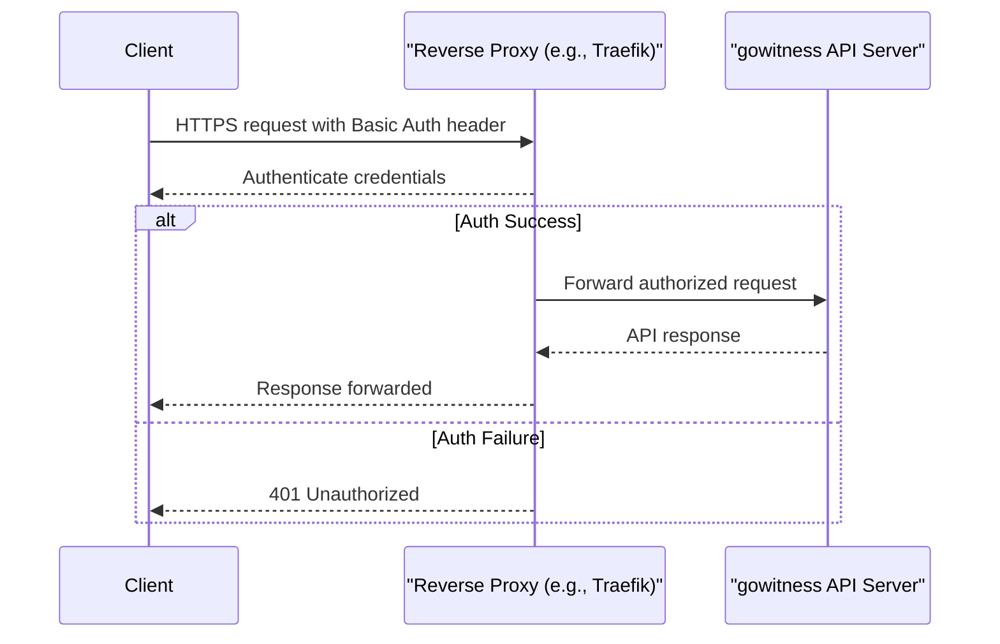

# Authentication & Authorization

gowitness APIs offer powerful programmatic access to scanning and managing web reconnaissance tasks. Understanding the authentication and authorization requirements is critical to securely and effectively using these API endpoints. This documentation guides you through the access model, token and header usage, and permissions scope necessary for interacting with gowitness APIs.

---

## Overview

By default, gowitness's API endpoints do not enforce authentication within the application itself. However, production deployments commonly secure the API server endpoints using external mechanisms such as HTTP Basic Authentication implemented by reverse proxies (e.g., Traefik) or other gateway layers.

This approach delegates user authentication and authorization to your infrastructure, providing flexibility in integrating with existing identity providers and access management solutions.


### Common Deployment Pattern With Basic Authentication

In the provided `docker-compose.yml` example, the gowitness API server runs behind Traefik, which enforces HTTP Basic Authentication to restrict access:

```yaml
services:
  gowitness:
    image: ghcr.io/sensepost/gowitness:latest
    command: gowitness report server --host 0.0.0.0 --screenshot-path /data/screenshots --db-uri sqlite:///data/gowitness.sqlite3
    volumes:
      - ./gowitness.sqlite3:/data/gowitness.sqlite3
      - ./screenshots:/data/screenshots
    labels:
      traefik.enable: true
      traefik.http.routers.gowitness.rule: Host(`gowitness.local`)
      traefik.http.routers.gowitness.entryPoints: web-secure
      traefik.http.routers.gowitness.tls.certResolver: default
      traefik.http.routers.gowitness.middlewares: basic-auth

  traefik:
    image: traefik:3.1
    command:
      - --log.level=INFO
      - --api.dashboard=true
      - --providers.docker
      - --providers.docker.exposedByDefault=false
      - --entryPoints.web-secure.address=:443
    ports:
      - 443:443
    volumes:
      - /var/run/docker.sock:/var/run/docker.sock:ro
    labels:
      traefik.enable: true
      traefik.http.middlewares.basic-auth.basicauth.users: gowitness:$$2y$$05$$7ADiPfM1kMABSUjofyUTOuJ7U6RcGi5fXeecyYnxjYwRluRRIO1..
      traefik.http.middlewares.basic-auth.basicauth.realm: gowitness
```


Users must authenticate via the configured HTTP Basic Auth mechanism before making API requests.

## Authentication Methods

### 1. External HTTP Basic Authentication (Recommended)

- Usually enforced by proxies like Traefik, Nginx, or Apache.
- Requires clients to provide an `Authorization: Basic <credentials>` header.
- Credentials are typically username and password pairs hashed and stored/configured in the proxy.

#### Usage:

For example, with `curl`:

```bash
curl --user gowitness:gowitness https://gowitness.local/api/ping
```

This method secures all endpoints transparently, requiring no changes to the gowitness API server itself.


### 2. No Built-in Authentication

gowitness API itself does not include token-based authentication (e.g., OAuth, JWT) or API key validation. Access control depends on your deployment environment and infrastructure.


## Authorization & Access Control

Since authentication is commonly handled externally, gowitness itself imposes no internal role-based access controls or scopes.

- Any authenticated user at the proxy level gains full API access.
- For fine-grained control, implement authorization via network policies, firewalls, or external API gateway policies.


## API Access Details

- All API requests must be made over HTTPS to secure credentials and data in transit.
- Include proper authentication headers as required by your deployment.
- Failure to authenticate will typically result in HTTP 401 Unauthorized responses from your reverse proxy or gateway.


## Troubleshooting Authentication Issues

<AccordionGroup title="Common Authentication Problems and Solutions">
<Accordion title="Missing or Incorrect Credentials">
Ensure the HTTP request includes a valid `Authorization` header. Test with a simple curl command using your username and password.
</Accordion>
<Accordion title="Proxy Misconfiguration">
Verify that the proxy (e.g., Traefik) is configured to protect API routes and that credentials are correctly set. Logs from Traefik or other reverse proxies can reveal authentication failures.
</Accordion>
<Accordion title="SSL/TLS Issues">
Make sure HTTPS is properly set up, certificates are trusted, and clients verify certificates correctly to prevent connection failures.
</Accordion>
</AccordionGroup>


## Best Practices for Secure API Usage

- Always deploy API endpoints behind a secure access control mechanism such as:
  - HTTP Basic Authentication with strong, rotated credentials
  - Mutual TLS authentication
  - API Gateways or proxies enforcing authenticated sessions

- Use HTTPS exclusively to prevent credential leakage.
- Regularly audit access logs and rotate credentials.
- Do not expose the API server to public networks without access restrictions.


## Summary

| Aspect           | Detail                                |
|------------------|-------------------------------------|
| Authentication   | External HTTP Basic Auth via Proxy   |
| Authorization    | Managed externally; full API access  |
| Token Usage      | Not supported natively               |
| Header Usage     | Standard `Authorization` header     |
| Security         | HTTPS mandatory, proxy enforced     |


---

## Practical Example

Here is an example of how to test your setup by pinging the server with the necessary authentication:

```bash
curl --user gowitness:gowitness https://gowitness.local/api/ping
```

Expected response:

```json
"pong"
```

This confirms that the server is reachable, the authentication works, and the API is accessible.


## Related Resources

- [Submitting Scan Requests](/api-reference/core-endpoints/submit-url)
- [Retrieving Results & Gallery API](/api-reference/core-endpoints/retrieve-results)
- [Error Handling & Status Codes](/api-reference/api-auth-errors/errors-status-codes)

---

## Diagram: Typical API Access Flow with Basic Authentication


