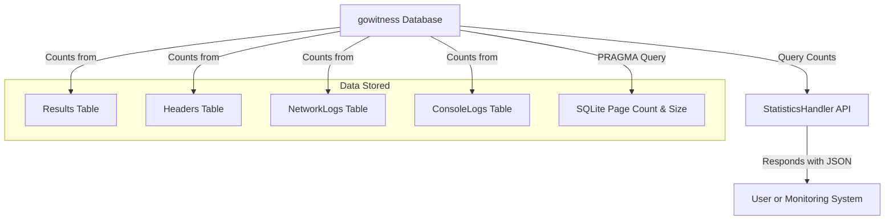

# Database Statistics API Reference

Access comprehensive summary statistics from your gowitness database to effectively monitor scan results, HTTP response distributions, and log activity. This endpoint provides critical metrics for health checks, reporting automation, and operational oversight.

---

## Overview

The Database Statistics endpoint exposes aggregated data about your gowitness result storage. It delivers counts of scan results, HTTP response codes, and tallies for different log types (network and console). This endpoint offers a quick health snapshot and usage metrics in a straightforward JSON format.

- **Endpoint:** `/statistics`
- **HTTP Method:** `GET`
- **Response Content-Type:** `application/json`

## Purpose and Use Cases

Users leverage Database Statistics to:

- Monitor total scan results stored in the database.
- Understand HTTP response code distributions across scanned URLs.
- Track the volume of network and console log entries recorded.
- Evaluate database size on disk to manage storage and plan maintenance.
- Power dashboards or alerts for scanning infrastructure health.

## Response Structure

The successful response provides the following JSON schema:

```json
{
  "dbsize": 12345678,
  "results": 1523,
  "headers": 2350,
  "networklogs": 8240,
  "consolelogs": 1750,
  "response_code_stats": [
    { "code": 200, "count": 1200 },
    { "code": 404, "count": 200 },
    { "code": 500, "count": 123 }
  ]
}
```

| Field               | Type     | Description                                  |
|---------------------|----------|----------------------------------------------|
| `dbsize`            | int64    | Database file size in bytes                   |
| `results`           | int64    | Total number of scanned result entries       |
| `headers`           | int64    | Count of all recorded HTTP headers           |
| `networklogs`       | int64    | Number of network log entries                 |
| `consolelogs`       | int64    | Number of console log entries                 |
| `response_code_stats` | array   | Aggregated list of HTTP response codes with counts |

Each `response_code_stats` item contains:

| Field  | Type | Description                         |
|--------|------|-------------------------------------|
| `code` | int  | HTTP response status code           |
| `count`| int64| Number of results with this status code |

## Practical Usage

### Retrieving Database Stats

To request statistics, send a GET request to the API:

```bash
curl -X GET "http://<your-gowitness-host>/statistics"
```

The API will respond with the JSON structure above, summarizing all key metrics.

### Using in Monitoring and Reporting

- Fetch stats regularly via API to feed dashboards showing database growth and scan success.
- Use response code breakdowns to identify trends like spikes in failed scans (4xx or 5xx).
- Monitor `dbsize` to plan archive or cleanup operations proactively.

## Implementation Details (For Clarity)

- The `dbsize` is calculated by querying the SQLite PRAGMA commands for page count and page size.
- Counts for results, headers, network logs, and console logs reflect the number of database rows.
- Response codes are grouped and counted by their HTTP status.
- Errors fetching statistics will be logged internally and result in empty or partial responses.

## Common Scenarios and Troubleshooting

### Scenario: Empty or Zero Counts

- Verify the database URI and connectivity.
- Make sure scans have successfully completed and data is recorded.
- Check if database migrations have been run properly.

### Scenario: Unexpected HTTP Codes Distribution

- Review scanning configurations to ensure valid URLs.
- Investigate network or scanning errors affecting result consistency.

### Scenario: Large Database Size

- Consider purging old or irrelevant scan data.
- Use report merging or conversion guides to manage database size efficiently.

## Related API and Documentation

- [Retrieve Results & Gallery API Reference](/api-reference/core-endpoints/retrieve-results): For browsing scan details.
- [Submit Scan Request](/api-reference/core-endpoints/submit-url): For submitting URLs to be scanned.
- [Generating and Viewing Reports](guides/reporting-and-results/generating-and-viewing-reports): CLI and web UI reporting workflows.
- [Upgrading, Merging, and Converting Reports](guides/reporting-and-results/upgrading-merging-and-converting-reports): Managing large or legacy datasets.

## Example JSON Response

```json
{
  "dbsize": 10485760,
  "results": 1000,
  "headers": 8500,
  "networklogs": 5000,
  "consolelogs": 1200,
  "response_code_stats": [
    { "code": 200, "count": 850 },
    { "code": 301, "count": 100 },
    { "code": 404, "count": 30 },
    { "code": 500, "count": 20 }
  ]
}
```

Use this data to inform your monitoring suite or to integrate into your continuous feedback around scan health and data ingestion.

---

*This API is supported for all database backends compatible with gowitness, including SQLite, PostgreSQL, and MySQL.*

---

## CLI Alternative

Though this endpoint is for API consumption, gowitness also provides the CLI command `gowitness report list` to summarize results from a database or JSON Lines file, displaying fields related to status, URL, failure state, and content size for quick review.

---

## Summary

The Database Statistics endpoint is a vital tool for real-time insight into your gowitness data store, helping users track volume, performance, scanning health, and trends with simple, aggregated metrics.

---

<AccordionGroup title="Quick Tips for Using Database Statistics">
<Accordion title="Monitor Regularly">
Set up scheduled API calls to gather stats and automate alerts on anomalies such as rising error codes or large database sizes.
</Accordion>
<Accordion title="Combine with Result Retrieval">
Use alongside the Retrieve Results endpoints to drill down from high-level stats into detailed scan data for troubleshooting.
</Accordion>
<Accordion title="Use in Dashboards">
Feed these stats into visualization tools or custom dashboards for continuous monitoring of your scanning infrastructure health.
</Accordion>
</AccordionGroup>

---

## Diagram: High-Level Data Flow for Database Statistics



This flow illustrates how the API aggregates database statistics from multiple tables and system queries, then presents them to the user or a consuming system.

---

## Contact and Support

For further assistance or integration support, consult the gowitness community channels, GitHub repository, or relevant guides linked above.


---