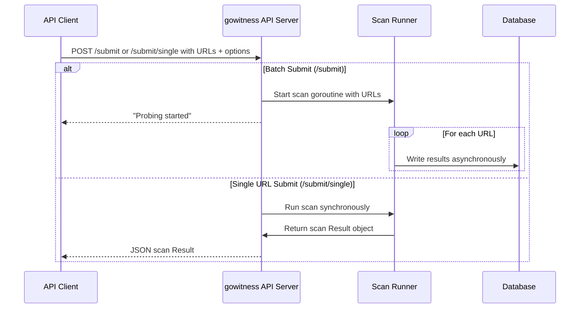

# Submit Scan Request API

This page details how to submit URLs for scanning through the gowitness API. It covers the structure of the request payloads, supported options for scan customization, behavior of asynchronous scanning workflows, and examples of both batch and single URL submissions. This empowers you to automate scanning tasks, track progress, and integrate gowitness smoothly into your reconnaissance or auditing pipelines.

---

## 1. Overview of Scan Submission

The scan submission API enables clients to submit one or multiple URLs for gowitness to process asynchronously. Submitted URLs are scanned by gowitness's headless Chrome-based browser drivers, capturing screenshots and metadata as configured. Results are stored in the configured database or returned directly depending on the endpoint.

Key characteristics:

- **Asynchronous processing for batch submits:** Submitted URLs start scanning immediately in the background. The endpoint returns promptly acknowledgment of scan start.
- **Synchronous result return for single submits:** When submitting a single URL, you can receive the scan result directly once it completes.
- **Flexible scan options:** Customize Chrome window size, user-agent string, timeout durations, delay before screenshot, and screenshot format.

This page documents two main endpoints:

- `/submit` — Batch submission of multiple URLs with options, returning immediate confirmation.
- `/submit/single` — Single URL submission returning the scan result upon completion.


## 2. Endpoint: Submit Multiple URLs

### HTTP Method & Path

- `POST /submit`

### Description

Starts scanning a list of URLs using provided or default options. The scan jobs run asynchronously, writing results to the database. The response confirms scan initiation.

### Request Payload

```json
{
  "urls": ["https://example.com", "https://another.com"],
  "options": {
    "window_x": 1920,
    "window_y": 1080,
    "user_agent": "Custom User-Agent",
    "timeout": 60,
    "delay": 3,
    "format": "jpeg"
  }
}
```

| Field      | Type     | Description                                                                                 |
|------------|----------|---------------------------------------------------------------------------------------------|
| `urls`     | array    | A list of target URLs to scan. Must be non-empty.                                          |
| `options`  | object   | Optional scan customization parameters (all optional):                                     |
| `window_x` | integer  | Width of browser window in pixels (default 1920)                                           |
| `window_y` | integer  | Height of browser window in pixels (default 1080)                                          |
| `user_agent` | string | Browser user-agent string to use for scans                                                  |
| `timeout`  | integer  | Seconds to wait before considering the page load timed out (default 60)                     |
| `delay`    | integer  | Seconds to wait after page load before capturing screenshot (default 3)                     |
| `format`   | string   | Screenshot image format, either `jpeg` or `png` (default `jpeg`)                            |

### Response

- Status: `200 OK`
- Body: Plain JSON string confirming scan start.

```json
"Probing started"
```

### Behavior

- The API immediately triggers the scan runner in a separate goroutine.
- URLs are enqueued and processed concurrently based on configured threads.
- Results are stored in the database configured on the server.
- Errors in DB connection or driver initialization return HTTP 500.
- Validation rejects empty URL lists with HTTP 400.

### Example Request (cURL)

```bash
curl -X POST https://api.example.com/submit \
  -H 'Content-Type: application/json' \
  -d '{
    "urls": ["https://sensepost.com", "https://example.org"],
    "options": {"timeout": 30, "format": "png"}
  }'
```

### Use Case

Ideal for bulk scanning automation where you want to trigger scans and query results later via reporting or search APIs.


## 3. Endpoint: Submit Single URL and Retrieve Result

### HTTP Method & Path

- `POST /submit/single`

### Description

Submits a single URL for scanning, returning the full scan result including screenshots and metadata once complete.

### Request Payload

```json
{
  "url": "https://example.com",
  "options": {
    "window_x": 1920,
    "window_y": 1080,
    "user_agent": "Custom User-Agent",
    "timeout": 60,
    "delay": 3,
    "format": "jpeg"
  }
}
```

| Field      | Type     | Description                                                             |
|------------|----------|-------------------------------------------------------------------------|
| `url`      | string   | The target URL to scan (must be provided, not empty)                    |
| `options`  | object   | Optional scan customization parameters (same as multi-submit endpoint)  |

### Response

- Status: `200 OK`
- Body: JSON object representing the scan `Result` with:
  - URL metadata (final URL, HTTP response code, headers)
  - Page title and protocol
  - Screenshot as a base64-encoded string (not saved to disk)
  - TLS information if available
  - Network request logs
  - Cookies
  - Error flags and reasons if any

Example snippet of response structure:

```json
{
  "url": "https://example.com",
  "final_url": "https://example.com",
  "response_code": 200,
  "title": "Example Domain",
  "screenshot": "<base64-encoded image>",
  "failed": false,
  "failed_reason": "",
  "cookies": [...],
  "headers": [...]
}
```

### Behavior

- Runs scan synchronously, awaiting completion.
- Does not save screenshots to disk; instead, returns them in the response.
- Uses in-memory writer to hold results for return.

### Example Request (cURL)

```bash
curl -X POST https://api.example.com/submit/single \
  -H 'Content-Type: application/json' \
  -d '{
    "url": "https://sensepost.com",
    "options": {"timeout": 30, "format": "png"}
  }'
```

### Use Case

Perfect when immediate feedback is needed per URL, such as building interactive systems or workflows that require scan results in real time.


## 4. Scan Options Explained

These optional parameters fine-tune the scanning process for your needs:

| Option         | Description                                                                                     | Default              |
|----------------|-------------------------------------------------------------------------------------------------|----------------------|
| `window_x`     | Width of the Chrome browser viewport in pixels                                                 | 1920                 |
| `window_y`     | Height of the browser viewport in pixels                                                       | 1080                 |
| `user_agent`   | Custom user-agent string to use                                                                 | Common modern UA string |
| `timeout`      | Maximum time in seconds to wait for page load before timing out                                | 60                   |
| `delay`        | Seconds to wait after navigation before taking the screenshot                                  | 3                    |
| `format`       | Screenshot image format, either `jpeg` or `png`. Determines image encoding quality and size.    | `jpeg`               |


## 5. Workflow Summary

1. **Prepare request** with target URLs and optional scan customization parameters.
2. **POST** to `/submit` for batch processing or `/submit/single` for immediate results.
3. For batch:
   - Server immediately acknowledges scan start.
   - Scans proceed asynchronously, results stored in database.
4. For single URL:
   - Server blocks until scanning completes.
   - Returns detailed scan result as JSON.
5. Use other API endpoints (e.g., `/search`, `/retrieve-results`) to fetch and analyze stored results.


## 6. Best Practices & Tips

- **Batch submissions:** Use `/submit` for high volume scans to maximize throughput and offload result handling.
- **Time settings:** Increase `timeout` and `delay` for slow-loading or JavaScript-heavy sites to improve screenshot success.
- **Format choice:** Use `png` for lossless images when detail is critical; `jpeg` for smaller file sizes.
- **User-Agent:** Specify realistic user-agents to avoid bot detection or blocking.
- **Monitoring:** Check server logs for scan errors if scans unexpectedly fail.
- **Storage:** Ensure your database is configured and has capacity, as scans may write large amounts of data.


## 7. Common Issues & Troubleshooting

- **Invalid or empty URLs:** API returns `400 Bad Request`. Validate your URL lists before submitting.
- **Database connection failures:** API returns `500`. Check database URI (`DbURI`) and access permissions.
- **Chrome driver issues:** Scans fail if Chrome is not properly installed or accessible on server.
- **Scan timeouts:** Increase the `timeout` option if pages fail to load.
- **Screenshot failures:** Use `delay` to allow dynamic content to load before capture.


## 8. Related Documentation

- [Retrieve Results & Gallery](../core-endpoints/retrieve-results) — Fetch stored scan results after submission.
- [Authentication & Authorization](../api-auth-errors/authentication) — Secure access for API usage.
- [Error Handling & Status Codes](../api-auth-errors/errors-status-codes) — Meaning of HTTP responses.
- [API Usage & SDK Examples](../api-auth-errors/api-usage-examples) — Code samples for integration.
- [Integrating with the gowitness Web API](../../guides/advanced-usage-and-integration/web-api-integration) — Guide to automate scans and retrieve results.


---

# Summary Mermaid Diagram: Scan Submission Workflow



---

## 9. Source Code References

<Source url="https://github.com/sensepost/gowitness" branch="main" paths={[{"path": "web/api/submit.go", "range": "1-68"},{"path": "web/api/submit_single.go", "range": "1-66"}]} />

---

By mastering this API page, you can programmatically kick off scans of web assets with gowitness, tailoring scan behavior and efficiently managing scanning at scale or interactively fetching detailed results on individual URLs.