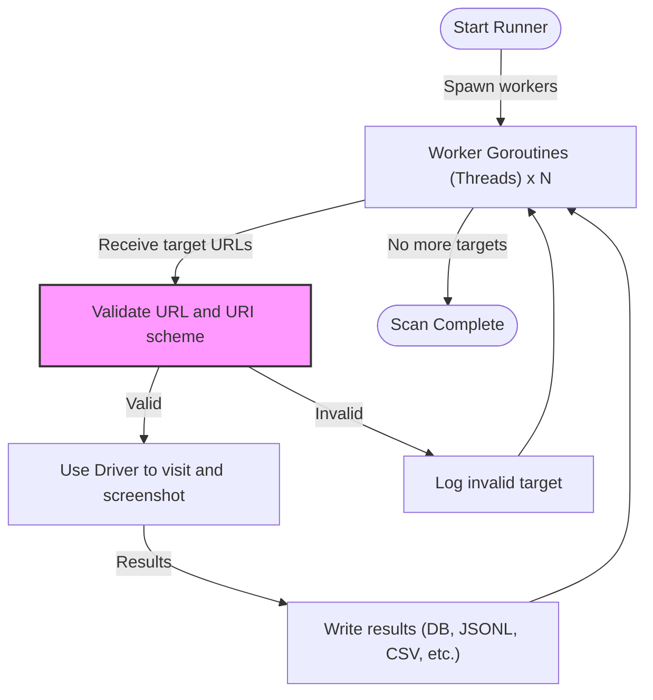

# Performance Optimization and Concurrency Tuning

Optimize your gowitness scanning processes to maximize throughput, reliability, and resource efficiency. This guide will walk you through tuning concurrency settings, timeouts, and Chrome-specific options to handle large scan volumes effectively while managing common error scenarios.

---

## 1. Workflow Overview

### Goal
Help users tune performance and concurrency parameters in gowitness to run high-volume scans efficiently with minimal errors.

### Prerequisites
- gowitness installed and operational
- Basic understanding of scanning concepts and gowitness configuration flags
- A scan target list suitable for batch processing

### Expected Outcome
Users will confidently adjust and balance thread counts, timeout values, and Chrome driver settings to optimize their scanning workload.

### Time Estimate
10-20 minutes for configuration and verification.

### Difficulty Level
Intermediate

---

## 2. Key Performance and Concurrency Parameters

Understanding and configuring the following options directly affects gowitness’s throughput and robustness.

### Scan Threads (`--threads`, `-t`)
- Controls the number of concurrent workers (goroutines) scanning targets.
- Default is 6.
- Increasing threads improves throughput but increases resource usage (CPU, memory).
- Too many threads can cause instability or Chrome crashes.

### Timeout (`--timeout`, `-T`)
- Maximum seconds to wait for a page to load before marking it timed out.
- Default is 60 seconds.
- Shorter timeout means faster failure detection but risks missing slow-loading pages.

### Delay between Navigation and Screenshot (`--delay`)
- Time to wait after page navigation before taking a screenshot.
- Default is 3 seconds.
- Increase if pages rely on JavaScript or dynamic content loading.

### Chrome Driver Options
- `--chrome-path`: Path to a Chrome binary; if empty, gowitness auto-downloads a compatible binary.
- `--chrome-proxy`: Proxy server for Chrome HTTP/SOCKS5.
- `--chrome-wss-url`: Connect to existing Chrome DevTools websocket instead of launching Chrome.
- `--chrome-user-agent`: Custom user-agent string.
- `--chrome-window-x` & `--chrome-window-y`: Browser window size in pixels, defaults 1920x1080.
- `--chrome-header`: Add custom HTTP headers.

### Screenshot Options
- `--screenshot-path`: Directory for screenshots.
- `--screenshot-format`: `jpeg` (default) or `png`.
- `--screenshot-fullpage`: Capture full scrollable page.
- `--screenshot-skip-save`: Skip saving to disk; useful when writing screenshots to other outputs.

---

## 3. Step-by-Step Tuning Instructions

<Steps>
<Step title="Set the Appropriate Number of Concurrent Threads">
Start by adjusting the `--threads` (`-t`) flag based on your machine’s CPU and memory capacity. 

- A common strategy is to start with 4-8 threads.
- Monitor system resources during a scan.
- If CPU or memory usage is high or Chrome crashes occur, reduce thread count.
- For high-capacity servers, try raising threads to boost throughput.

Example:

```bash
gowitness scan file -f targets.txt -t 8 --write-db
```

**Expected result:** Simultaneous probing of 8 URLs in parallel.
</Step>

<Step title="Adjust Page Load Timeout">
Timeout controls how long gowitness waits for a page load before giving up.

- If many pages are slow or times out prematurely, increase `--timeout` (e.g., 90 seconds).
- For fast, stable networks, reduce timeout to free resources faster.

Example:

```bash
gowitness scan file -f targets.txt -T 90 --write-db
```

**Expected result:** Pages with longer load times are less often marked as failed due to timeout.
</Step>

<Step title="Fine-tune Navigation Delay Before Screenshotting">
Dynamic content often requires a delay.

- Increase `--delay` to capture fully rendered pages.
- Use a minimum delay of 2-3 seconds; adjust based on page complexity.

Example:

```bash
gowitness scan file -f targets.txt --delay 5
```

**Expected result:** Screenshots capture content after scripts and lazy loads complete.
</Step>

<Step title="Optimize Chrome Driver Behavior">
Tailor Chrome launch or connection options for your environment.

- Use `--chrome-path` to specify a stable Chrome if default binary causes issues.
- Use `--chrome-wss-url` to connect to a single remote Chrome instance when resources for launching many Chrome processes are limited.
- Use proxies (`--chrome-proxy`) if scanning behind firewalls.

Example:

```bash
gowitness scan file -f targets.txt --chrome-path /usr/bin/google-chrome-stable
```

**Expected result:** Stable Chrome operation customized to your system.
</Step>

<Step title="Manage Screenshot Output and Storage">
Controlling screenshot storage reduces I/O overhead.

- Store screenshots in compressed JPEG to reduce write time and storage.
- Use `--screenshot-skip-save` if you prefer writing screenshots to database or JSON Lines.
- Use `--write-db` or `--write-jsonl` writers to centralize results.

Example:

```bash
gowitness scan file -f targets.txt --write-db --screenshot-format jpeg
```

**Expected result:** Screenshots saved efficiently and results stored in centralized location.
</Step>
</Steps>

<Note>
Always balance concurrency and timeouts to your system’s capacity and the scan target’s responsiveness. Excessive threads or inadequate timeouts cause failures or incomplete results.
</Note>

---

## 4. Practical Examples

### Example 1: Moderate Speed Scan on Local Machine
```bash
gowitness scan file -f targets.txt -t 4 -T 60 --delay 3 --write-db
```
- Uses 4 threads for moderate concurrency
- 60 second timeout
- 3 second delay before screenshot
- Stores results in a SQLite database

### Example 2: High Throughput Scan on Server
```bash
gowitness scan file -f targets.txt -t 10 -T 90 --delay 5 --write-db --chrome-proxy socks5://127.0.0.1:9050
```
- 10 threads for higher concurrency
- Increased timeout and delay for slow-loading sites
- Proxy for privacy or network routing
- Results persisted to database

### Example 3: Using an Existing Chrome Instance
```bash
gowitness scan file -f targets.txt --threads 6 --chrome-wss-url ws://localhost:9222 --write-jsonl
```
- Connects to a remotely running Chrome debug instance
- 6 concurrent workers
- JSON Lines output

---

## 5. Troubleshooting & Tips

### Common Issues
- **Chrome not found error:** Verify or set `--chrome-path` to a valid Chrome binary.
- **Excessive failures or timeouts:** Increase timeout with `--timeout` or reduce thread count.
- **High memory or CPU usage:** Lower `--threads` or limit screenshot sizes with reduced window dimensions.
- **Screenshots not saved:** Ensure `--screenshot-path` exists and permissions are correct.
- **Errors related to too many open files:** Limit concurrency or adjust system limits.

### Best Practices
- Start scans with default concurrency (`6`) and timeout (`60s`). Adjust incrementally.
- Monitor system load; use tools like `top` or `htop`.
- Use `--log-scan-errors` to capture failures for diagnosis.
- For large scans, batching targets into smaller chunks helps mitigate failures.
- Use `--write-db` or `--write-jsonl` for reliable persistent output.
- Define URL filters (`--uri-filter`) to reduce invalid targets.

### Performance Considerations
- Increasing window resolution (`--chrome-window-x` and `--chrome-window-y`) increases resource consumption.
- Full page screenshots require more memory than viewport-only captures.
- Using remote Chrome instances (`--chrome-wss-url`) can consolidate resource usage.

<Warning>
Saving full content (`--save-content`) can exponentially increase storage requirements and slow scans. Use only when explicitly needed.
</Warning>

---

## 6. Understanding the Concurrency Model

gowitness uses a pool of worker goroutines equal to the `--threads` count. Each worker:

- Takes a URL target from a shared channel
- Validates the target
- Uses the configured driver (`gorod` or `chromedp`) to probe and screenshot
- Passes results to configured writers

If a worker detects a fatal Chrome error (such as missing Chrome binary), the scan halts immediately.

Diagram illustrating concurrency flow:



This design ensures efficient parallel processing while providing error isolation per target.

---

## 7. Next Steps & Related Documentation

- [Quick Configuration Guide](/getting-started/setup-and-configuration/quick-configuration) — Basic setup and scanning best practices.
- [Scanning Multiple Targets](/guides/scanning-workflows/scanning-multiple-targets) — Manage large scale scans with best concurrency patterns.
- [Understanding Output Formats](/getting-started/setup-and-configuration/understanding-output-formats) — Optimize result storage.
- [Troubleshooting Common Issues](/getting-started/your-first-scan/troubleshooting-common-issues) — Resolve scan errors and Chrome driver quirks.
- [Integrating with gowitness Web API](/guides/advanced-usage-and-integration/web-api-integration) — Run scans via API for automation.

---

<Tip>
Regularly review resource usage and scan success rates when tuning concurrency and timeouts. Optimal settings vary widely depending on network speed, target responsiveness, and hardware.
</Tip>

---

## 8. Appendix: Common Flag Examples

```bash
# Moderate concurrency with DB writer
gowitness scan file -f targets.txt -t 6 --write-db --timeout 60 --delay 3

# Faster scan with more threads, longer timeout and delay
gowitness scan file -f targets.txt -t 10 --write-jsonl --timeout 90 --delay 5

# Connect to remote Chrome instance
gowitness scan file -f targets.txt --chrome-wss-url ws://localhost:9222 --threads 5
```

---

This guide ensures you harness gowitness’s concurrency model and tuning options effectively, balancing throughput, stability, and resource usage for your scanning needs.

---