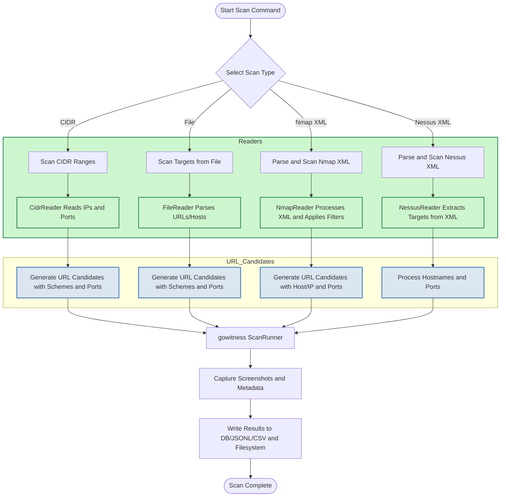

# Scanning Network Ranges and External Tool Results with gowitness

Explore how to leverage gowitness's powerful integrations with network scanning tools like Nmap and Nessus, alongside flexible CIDR and file-based target scanning. This guide walks you through importing scan results, parsing them, and capturing screenshots to consolidate your web service reconnaissance.

---

## 1. Workflow Overview

### Task Description
This guide enables you to use gowitness to scan entire network ranges or targets exported from external scanning tools such as Nmap and Nessus. You'll learn how to import and parse scan results, enrich them with URL schemes and port permutations, and capture screenshot metadata for web services discovered.

### Prerequisites
- gowitness installed and properly configured (see [Installing gowitness](https://docs.gowitness.net/getting-started/getting-ready/installing-gowitness)).
- Access to Nmap XML or Nessus XML exported scan results, or CIDR ranges for direct network scanning.
- Basic knowledge of network scanning and web reconnaissance concepts.
- Optional: A configured database (SQLite, Postgres, or MySQL) or JSONL/CSV writers for richer metadata storage.

### Expected Outcome
- Successfully import Nmap/Nessus scan files or define CIDR network targets.
- Generate URL candidates to screen relevant web services.
- Capture screenshots and metadata with gowitness's scanning engine.
- Export or store results using preferred writers for later analysis.

### Time Estimate
Approximately 15 to 30 minutes to complete initial scans, depending on target size and network performance.

### Difficulty Level
Intermediate — assumes familiarity with command-line tools and network scanning exports.

---

## 2. Step-by-Step Instructions

### 2.1 Scanning Network CIDR Ranges

Use gowitness to scan all hosts and ports within a specified IP range.

<Steps>
<Step title="Prepare CIDR Input">
Provide one or more CIDR ranges you want to scan. You can either specify them on the command line or supply a file containing CIDR ranges.
</Step>
<Step title="Select Ports to Scan">
By default, gowitness scans ports 80 and 443. Use the flags `--port`, `--ports-small`, `--ports-medium`, or `--ports-large` to adjust port lists.
</Step>
<Step title="Execute the CIDR Scan">
Run:

```bash
gowitness scan cidr --cidr 192.168.1.0/24 --port 80 --port 443 --write-db
```

Or specify a CIDR file with:

```bash
gowitness scan cidr --cidr-file cidrs.txt --threads 20 --write-jsonl
```

Use `--no-http` or `--no-https` to exclude URL schemes if needed.
</Step>
<Step title="Result Verification">
Check your screenshot path (`--screenshot-path`, default is `./screenshots`) for saved images. If using writers, verify output files or database for metadata.
</Step>
</Steps>

### 2.2 Scanning Targets from a File

Scan a list of URLs or hostnames stored in a file or piped via stdin.

<Steps>
<Step title="Create Target File">
Prepare a newline-separated file with domains or IPs (with or without protocol and ports). Invalid URLs will be skipped.
</Step>
<Step title="Run File Scan">
Execute:

```bash
gowitness scan file --file targets.txt --threads 10 --write-csv
```

Or via stdin:

```bash
cat targets.txt | gowitness scan file -f - --write-jsonl
```
</Step>
<Step title="Result Verification">
Confirm screenshots and output files are saved. Use `gowitness report list --json-file gowitness.jsonl` to summarize.
</Step>
</Steps>

### 2.3 Importing and Scanning Nmap XML Files

Use gowitness to import Nmap scan results and capture web service screenshots.

<Steps>
<Step title="Export Nmap XML">
Run your Nmap scan with the `-oX` flag:

```bash
nmap -p 80,443 -sV target-network -oX scan-results.xml
```
</Step>
<Step title="Run gowitness Nmap Scan">
Invoke gowitness:

```bash
gowitness scan nmap --file scan-results.xml --open-only --service http --write-db
```

Adjust flags as needed:
- `--open-only` to scan only open ports
- `--service`, `--service-contains` to filter HTTP related services
- `--no-http` or `--no-https` to control URL schemes
- `--hostnames` to include hostnames in URL candidates
</Step>
<Step title="Confirm Screenshots and Metadata">
Check screenshots in the path specified by `--screenshot-path` and query your output files or database to review gathered data.
</Step>
</Steps>

### 2.4 Importing and Scanning Nessus XML Files

Extract web services from Nessus exports and target them with gowitness.

<Steps>
<Step title="Export Nessus XML">
Export scan results in Nessus XML format (called "Nessus" in export menus).
</Step>
<Step title="Run gowitness Nessus Scan">
Execute:

```bash
gowitness scan nessus --file scan.nessus --write-jsonl --service-name www --plugin-output "web server"
```

Use flags to customize:
- `--hostnames` to include detected hostnames
- `--service-name`, `--plugin-output`, `--plugin-name` to refine detection filters
</Step>
<Step title="Verify Outputs">
Validate screenshots and metadata outputs in configured storage locations.
</Step>
</Steps>

---

## 3. Important Flags and Options

| Flag | Description |
| --- | --- |
| `--threads, -t` | Number of concurrent scanning threads (default 6) |
| `--port` | Specific ports to scan (can be used multiple times) |
| `--no-http` / `--no-https` | Exclude the HTTP or HTTPS schemes for generated URLs |
| `--write-db` | Save results to a SQLite or configured database |
| `--write-jsonl` | Write results as JSON lines |
| `--write-csv` | Output results in CSV format (limited columns) |
| `--hostnames` | Use hostnames in URL candidates (Nmap and Nessus scans) |
| `--open-only` | Scan only ports marked as open (for Nmap scan) |
| `--service`, `--service-contains` | Filter ports/services based on name strings in Nmap or Nessus data |

---

## 4. Practical Examples

### Example 1: Scan CIDR with Medium Ports List

```bash
gowitness scan cidr --cidr 10.0.0.0/24 --ports-medium --write-db
```

This scans all hosts in `10.0.0.0/24` on medium-sized port list and stores results in the database.

### Example 2: Import Nmap scan excluding non-HTTP ports

```bash
gowitness scan nmap -f ./nmap.xml --open-only --service http --write-jsonl
```

Captures screenshots only of HTTP-related open ports from Nmap XML data, outputting JSON lines.

### Example 3: Scan a target list file, disabling HTTP scheme

```bash
gowitness scan file -f ./targets.txt --no-http --write-csv
```

Generates HTTPS URLs only for targets listed in `targets.txt` and outputs CSV results.

---

## 5. Troubleshooting & Tips

<AccordionGroup title="Common Issues When Scanning Network Ranges and External Results">
<Accordion title="Empty or Missing Scan Results">
Verify that the source XML or CIDR targets are valid and readable. For Nmap and Nessus, ensure the file paths are correct and well-formed XML.
</Accordion>
<Accordion title="Screenshots Not Being Saved">
Check your `--screenshot-path` setting and confirm directory permissions. Also verify that you have not enabled `--screenshot-skip-save` accidentally.
</Accordion>
<Accordion title="Too Many Targets or Overload">
Use the `--threads` flag to control the number of concurrent goroutines. Lowering concurrency can reduce load on networks and scanning agents.
</Accordion>
<Accordion title="URLs Generated Without Expected Protocols or Ports">
Use the `--no-http` and `--no-https` flags carefully. Also, when scanning files or CIDRs, ensure ports to scan are defined correctly.
</Accordion>
<Accordion title="Nmap Service Filters Not Working as Expected">
Double-check your `--service` and `--service-contains` filters. They are case-sensitive and matched against Nmap’s service names.
</Accordion>
<Accordion title="Nessus Filters Not Detecting Expected Hosts or Services">
Adjust `--plugin-name`, `--plugin-output`, and `--service-name` filters to fine-tune what services gowitness parses.
</Accordion>
</AccordionGroup>

<Tip>
Consider running scans during off-peak hours to minimize network impact, especially when scanning large CIDR ranges.
</Tip>

<Tip>
For large-scale scanning, use persistent writers like a database or JSONL files to enable easy querying and reporting post-scan.
</Tip>

---

## 6. Next Steps & Related Content

- After scanning, use the [Validating and Viewing Results](https://docs.gowitness.net/getting-started/your-first-scan/validating-results) guide to explore your scan data.
- Check out [Choosing Output Formats and Storing Results Effectively](https://docs.gowitness.net/guides/reporting-and-results/output-formats-best-practices) to optimize result management.
- For automation, explore [Integrating with the gowitness Web API](https://docs.gowitness.net/guides/advanced-usage-and-integration/web-api-integration).
- Review [Performance Optimization and Concurrency Tuning](https://docs.gowitness.net/guides/advanced-usage-and-integration/performance-and-concurrency-tuning) to handle large workload efficiently.

---

## 7. Diagram: gowitness Workflow for Network Range and External Tool Scans



---

For a complete understanding, combine this guide with the [Quick Configuration](https://docs.gowitness.net/getting-started/setup-and-configuration/quick-configuration) and the [Running Your First Scan](https://docs.gowitness.net/getting-started/your-first-scan/running-your-first-scan) guides.


