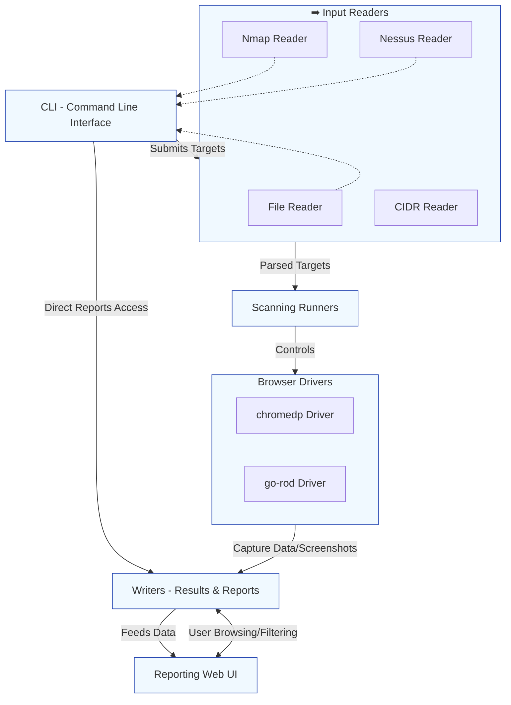

# gowitness System Architecture

Unlocking the power of gowitness begins with understanding how its key components interact to transform your input into insightful, actionable output. This diagram-driven overview maps the system's architecture, revealing how CLI commands, scanning runners, browser drivers, input readers, writers, and the reporting web UI work together seamlessly. Whether you're submitting single URLs or bulk scans from files, network ranges, or results from external tools, this architecture is designed for extensibility, flexibility, and clarity.

---

## Overview: What Does This Architecture Reveal?

At its core, gowitness is a robust scanning system that takes user input through various channels, processes it with efficient scanning runners utilizing advanced browser automation, and outputs richly detailed results accessible both on the command line and through a modern web UI.

This page visually maps and explains the main building blocks of gowitness including:

- **User Interface:** A CLI for direct interaction.
- **Scanning Runners:** Manage concurrent scans to handle multiple targets efficiently.
- **Drivers:** Chromium-based browser automation engines (`chromedp` and `go-rod`) that perform the actual web interactions and screenshot capturing.
- **Input Readers:** Versatile modules for ingesting targets from files, CIDR blocks, and external tool outputs like Nmap and Nessus.
- **Writers:** Components responsible for persisting results and reports.
- **Reporting Web UI:** A feature-rich user interface to browse, search, and analyze scan results visually.

We also highlight the extensibility points such as integration with files and APIs, which allow users to expand gowitness capabilities according to their workflow needs.

---

## User Journey Through the gowitness System

Imagine you want to scan a set of URLs, some of which come from an Nmap scan, others from a CIDR block, and a few you input directly via the CLI. Here’s how gowitness handles that:

1. **User Input:** You submit URLs or scan results through the CLI or import them from files.
2. **Input Readers:** Specialized readers parse these inputs — whether raw URLs, network ranges (CIDRs), or structured Nmap/Nessus output formats — preparing targets for scanning.
3. **Scanning Runners:** These orchestrate scanning jobs concurrently, deciding which targets to probe next in an optimized queue.
4. **Browser Drivers:** Under the hood, the scanning runners command Chrome instances using either `chromedp` or `go-rod` to visit each target, capture screenshots, and extract relevant data.
5. **Writers:** Once the scan completes, extracted metadata, screenshots, network logs, and other data are written to the database and disk.
6. **Reporting Web UI:** You access the scan results via a rich, searchable web interface that organizes data for easy navigation and analysis.

This flow is designed to minimize manual intervention while maximizing scanning throughput, reliability, and result clarity.

---

## Core Components Detailed

### 1. Command Line Interface (CLI)

- **Purpose:** The primary user entry point to launch scans.
- **Functionality:** Accepts single or batch scan targets and options like output format, delays, timeouts, and browser configurations.
- **Benefit:** Enables automation-friendly, scriptable workflows.

### 2. Scanning Runners

- **Function:** Manage and schedule scan tasks across multiple targets concurrently.
- **Why it Matters:** Efficient use of system resources ensures faster scanning while avoiding bottlenecks.

### 3. Browser Drivers (`chromedp` and `go-rod`)

- **Role:** Programmatic control of headless Chromium browsers to render pages, capture screenshots, and gather detailed page data.
- **Differentiator:** Support for multiple drivers allows choosing the most compatible or performant option per environment.

### 4. Input Readers

- **Types:**
  - File Readers: Import URLs from text or structured files.
  - CIDR Readers: Convert IP ranges into scan targets.
  - Nmap/Nessus Readers: Parse outputs from external scanning tools to reuse target insights.
- **Advantage:** Flexibility in input methods reduces effort in preparing scan targets.

### 5. Writers

- **Purpose:** Save scan results, screenshots, and metadata reliably in formats optimized for reporting and retrieval.

### 6. Reporting Web UI

- **Description:** A visually rich interface for browsing, filtering, searching, and comparing scan results.
- **User Value:** Streamlines analysis and collaborative reporting.

---

## Architecture Diagram

---

## Practical Insights & Best Practices

- **Choosing Your Input Method:** Bulk scans benefit from input readers that support batch sources like CIDR blocks or Nmap files. For one-off URLs, CLI direct input suffices.

- **Optimizing Scan Speed:** Scanning runners efficiently parallelize work. Tune concurrency based on your system resources to maximize throughput without overloading your machine.

- **Selecting Drivers:** Try `chromedp` for stability and low resource usage; use `go-rod` when advanced driver features or compatibility issues arise.

- **Leveraging Reporting UI:** Use the web UI to quickly triage, compare, and manage scan results, especially when handling large datasets.

- **Extensibility:** Integrate gowitness with external workflows by feeding inputs via files or leveraging the API, enabling continuous surveillance or large-scale reconnaissance.

---

## Troubleshooting Common Issues

- **Scan Queues Not Progressing:** Confirm input readers parse your target list correctly. Check runner concurrency settings.

- **Browser Driver Failures:** Ensure the relevant Chromium dependencies are installed and drivers are compatible with your OS.

- **No Results in Web UI:** Verify the writers correctly saved scan data and your database is accessible.

- **Large Input Files Slow to Load:** Split large source files for better performance and stability.

---

## Next Steps

To leverage this architecture effectively:

- Start with the [Quick Configuration guide](../getting-started/setup-and-configuration/quick-configuration) to prepare your environment.
- Proceed to [Running Your First Scan](../getting-started/your-first-scan/running-your-first-scan) to execute a real scan.
- Explore the [Integration and Extensibility](../overview/architecture-features/integration-overview) page to customize input feeding and reporting.

Understanding the system architecture empowers you to tailor gowitness for your specific reconnaissance and monitoring workflows—turning raw scan data into meaningful intelligence.

---

For deeper context on gowitness capabilities, review our product introduction and target audience pages linked in this documentation suite.

---

*Generated from the gowitness source repository: [GitHub](https://github.com/sensepost/gowitness)*