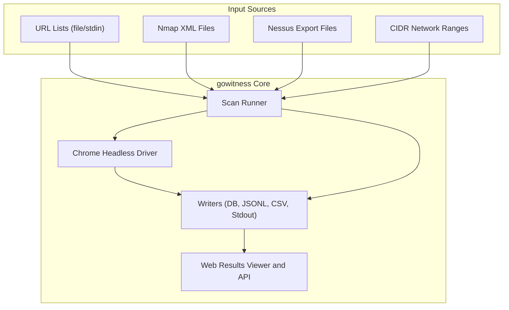

# Feature Highlights

Discover the powerful capabilities at the core of gowitness that set it apart as a premier web screenshot and reconnaissance tool. This page presents a focused snapshot of gowitness’s standout features, enabling rapid, precise, and flexible data capture from a wide variety of web targets.

---

## Rapid Screenshotting with Chrome Headless

gowitness leverages Chrome Headless to efficiently take high-quality screenshots of web targets. It is optimized to perform fast captures while maintaining accuracy, allowing you to visually audit numerous sites quickly.

**What this means for you:**
- Save time performing bulk scans with concurrent screenshotting.
- Capture true renderings of web pages, including complex modern layouts.
- Optionally capture full-page screenshots to see entire content beyond the viewport.

### Practical Example
Imagine scanning a list of 500 external URLs from a penetration test. gowitness rapidly cycles through these targets, rendering each page headlessly and storing crisp JPEG or PNG screenshots, ready for review.

---

## Multi-Source Target Intake

gowitness can ingest targets from diverse sources, making it adaptable to many scenarios:

- **Plain URL lists:** Supply newline-separated URLs from files or stdin.
- **Nmap XML files:** Parse Nmap scan results to identify HTTP/S services worth snapshotting.
- **Nessus exports and more:** Use exports from popular scanners.
- **CIDR ranges:** Scan entire network blocks for web interfaces.

**Value to you:**
- Seamlessly integrate with other tools and workflows.
- Automate large, complex discovery and reconnaissance tasks.
- Apply fine control over which ports and services to include or exclude.

---

## Advanced Data Capture

Beyond screenshots, gowitness captures rich metadata to deepen your understanding of each web target, including:

- **Request and response logs:** Track HTTP interactions for diagnostics or audit trails.
- **Console logs:** Record browser console output to spot runtime errors or warnings.
- **Cookies and headers:** Gather session data and security-related headers.

**Benefit:** Enables forensic-level insight during assessments, helping diagnose issues or security weaknesses beyond visual appearance.

---

## Multiple Output Formats

gowitness offers flexible output options so you can save and process scan results in the manner best suited to your workflow:

- **SQLite database:** Ideal for structured querying and powering the web UI.
- **JSON Lines:** Easily integrate with other tools or pipelines.
- **CSV:** For simple tabular reports with essential fields.
- **Standard output:** Stream results directly for scripting convenience.

This ensures your data is accessible in the format you need—whether it's for automation, reporting, or manual analysis.

---

## Web-Based Results Viewer and API

Once you have saved data to an SQLite database, gowitness enables an interactive web UI that provides:

- A centralized gallery to browse screenshots with summaries
- Detailed drill-down views showing metadata, logs, and headers per target
- Search and filtering capabilities for rapid issue identification
- A feature-rich REST API for integration with SIEMs, dashboards, or other tooling

**End user impact:**
- Simplified results management across large scans
- Enhanced collaboration by sharing results via a web interface
- Programmatic access for automation or custom integrations

---

## How These Features Work Together



---

## Practical Tips to Maximize Feature Benefits

- **Combine input sources for thorough coverage.** For example, parse both Nmap and URL lists to catch all common entry points.
- **Use port and service filters** when scanning Nmap or CIDRs to avoid futile screenshots of non-web services.
- **Enable metadata collection** selectively (request logs, cookies) only where needed to balance storage size.
- **Leverage the web UI** for collaborative reporting during team engagements.
- **Integrate JSONL outputs** with continuous pipelines for automated vulnerability scanning or alerting.

---

## Common Pitfalls to Avoid

- Forgetting to specify output writers means screenshots are saved but no metadata is persisted for reporting.
- Scanning large CIDR ranges without port filtering can waste resources on non-HTTP services.
- Enabling `save-content` without storage management can quickly exhaust disk space.

---

## Getting Started

To experience these features:

1. Use a scan command with an input source and specify writers:  
```bash
   gowitness scan file -f targets.txt --write-db --write-jsonl
```
2. Start the web UI to explore results:  
```bash
   gowitness report server --port 7171 --db-uri sqlite://gowitness.sqlite3
```
3. Open your browser to `http://127.0.0.1:7171` and begin reviewing.

Next, explore detailed guides on [Quick Configuration](../getting-started/setup-and-configuration/quick-configuration) and [Running Your First Scan](../getting-started/your-first-scan/running-your-first-scan).

---