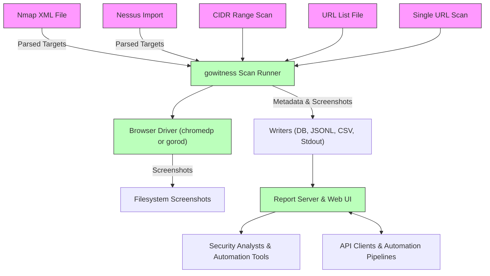

# Integration and Extensibility

gowitness is designed to seamlessly fit into and elevate your existing security operations by supporting diverse input sources, flexible automation via CLI and API, and multiple reporting outputs. This page shows how to integrate gowitness with other industry-standard scanners, automate workflows for continuous testing, and extend its capabilities in scripting and CI/CD environments.

---

## Why Integration Matters

In modern security environments, tools rarely operate in isolation. gowitness complements your current tooling by ingesting scan outputs from Nmap and Nessus, allowing you to leverage reconnaissance already conducted and enrich it with visual context. This integration avoids redundant work, enhances data correlation, and streamlines your vulnerability assessment process.

---

## Importing External Scanner Results

### Using Nmap XML Files

Import your Nmap scan results to automatically generate screenshot targets from detected web services. gowitness parses the Nmap XML to extract open ports and URLs, which it then navigates and captures.

**Key features:**

- Supports filtering ports and services to focus scans on HTTP(S) endpoints.
- Options to include or exclude hostnames for virtual hosting contexts.
- Controls for scanning only open ports or broad inclusion.

**Example usage:**
```bash
gowitness scan nmap -f ~/nmap_results.xml --write-jsonl --threads 20
```

### Using Nessus XML Files

Leverage Nessus scan exports to pinpoint web assets identified during vulnerability scanning.

**Capabilities include:**

- Filters on plugin names, service names, and plugin output to hone in on web services.
- Optionally include hostnames for target URL construction.

**Example usage:**
```bash
gowitness scan nessus -f ~/nessus_export.nessus --write-db --port 80
```

### Scanning CIDR Network Blocks

For network-wide assessments, gowitness accepts CIDR ranges directly to produce permutations of IPs, ports, and protocols to scan.

**Features:**

- Add custom ports or use predefined port lists (small, medium, large) for comprehensive coverage.
- Optionally randomize target order to evade alerts.

**Example usage:**
```bash
gowitness scan cidr -c 10.0.0.0/24 --ports-medium --write-jsonl
```

### Scanning URL Lists

Import plain text lists or piped URLs for flexible batch scanning.

**Example usage:**
```bash
cat urls.txt | gowitness scan file -f - --write-csv
```

---

## Automation and Scripting

gowitness is crafted to be fully scriptable, supporting both CLI batch operations and API interactions, empowering you to embed screenshot workflows into automated pipelines.

### CLI Automation

All scan commands support a rich set of flags to control concurrency, output formats, and scan behavior, allowing fine-tuned scripting in shell environments.

**Tips:**

- Use `--threads` to adjust concurrency for performance tuning.
- Combine multiple `--write-*` output formats for flexible data integration.
- Use `--log-scan-errors` to capture network or timeout issues during automated runs.

### API Integration

The built-in web UI also exposes a full-featured API to submit scan requests, retrieve results, and query stored data programmatically. This allows bridging gowitness with broader security platforms or dashboards.

**Usage example:**
- Submit new URLs for scanning using the API.
- Fetch screenshot galleries and metadata for reporting.

Refer to the [gowitness Web API Integration guide](/guides/advanced-usage-and-integration/web-api-integration) for detailed instructions.

---

## Reporting Workflows and Output Extensions

gowitness supports multiple output formats to suit varied reporting and integration needs.

### Output Writers

Results can be stored in one or more of the following formats:

- **SQLite Database:** For comprehensive storage, querying, and use with the interactive report server.
- **JSON Lines (jsonl):** Easily parsed, line-delimited JSON objects ideal for log ingestion or further JSON processing.
- **CSV:** Simple tabular data export for spreadsheets or legacy reporting tools.
- **Zipped HTML:** Bundled report pages suitable for offline viewing.

You can combine these writers to create multi-format output suited for your workflows. For instance, storing in a DB for UI browsing while exporting JSONL for automation.

---

## Non-interactive and CI/CD Workflows

gowitness is built for headless use. It integrates well into continuous integration pipelines or automated testing stacks.

**Best practices:**

- Fully script scanning with CLI commands and output flags.
- Use SQLite DB outputs combined with the report server for on-demand result browsing.
- Cleanly close runners after scans (`scanRunner.Close()`) to ensure graceful resource release in automation.

---

## Practical Integration Example

Imagine a penetration test starting with an Nmap scan. Export the scan XML, then run gowitness to visualize all HTTP and HTTPS endpoints found:

```bash
nmap -p 80,443 -oX nmap_results.xml 10.10.10.0/24
gowitness scan nmap -f nmap_results.xml --write-db --write-jsonl
gowitness report server --db-uri sqlite://gowitness.sqlite3
```

This workflow centralizes reconnaissance data and images for rapid triage and manual testing.

---

## Summary

By supporting external scanner results, multiple output formats, and both CLI and API workflows, gowitness integrates smoothly with existing security tools and automation pipelines. Its extensibility points provide flexibility for integrating into customized security operations, enabling efficiency gains and enriched data insights.

---

## Additional Resources

- [Quickstart: Scan a Single Website](/guides/scanning-workflows/quickstart-single-scan)
- [Scanning Network Ranges & External Tool Results](/guides/scanning-workflows/network-ranges-external-results)
- [Choosing Output Formats & Best Practices](/guides/reporting-and-results/output-formats-best-practices)
- [Integrating with the gowitness Web API](/guides/advanced-usage-and-integration/web-api-integration)
- [gowitness System Architecture](/overview/architecture-features/architecture-diagram)

---

### Visual Overview of Integration Workflow



---

## Troubleshooting Integration Points

<AccordionGroup title="Common Issues and Solutions">
<Accordion title="Imported Targets Not Being Scanned">
- Verify input file paths and readability.
- Confirm correct use of `--write-*` flags to save results.
- Use `--no-http` or `--no-https` flags appropriately based on target URLs.
</Accordion>
<Accordion title="Excessive Storage Usage When Saving Content">
- Avoid using the `--save-content` flag unless necessary.
- Use selective writing formats to control data size.
</Accordion>
<Accordion title="Scan Runner Concurrency Too High/Low">
- Adjust `--threads` count based on system resources and network capacity.
</Accordion>
<Accordion title="API Calls Failing or Not Authorized">
- Check API server running status (see `gowitness report server`).
- Verify `db-uri` paths and connectivity.
</Accordion>
</AccordionGroup>