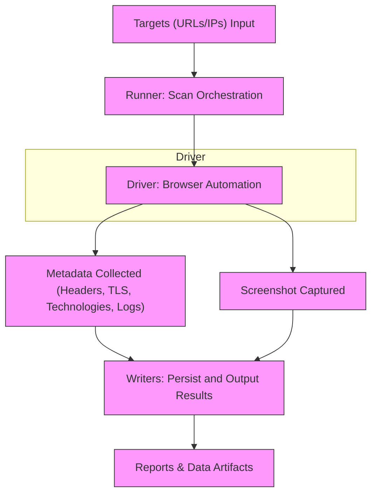

# Core Concepts and Terminology

Welcome to the foundational guide that equips you with essential terms and concepts to confidently navigate gowitness. Understanding the domain-specific vocabulary—such as **targets**, **screenshots**, **runners**, **drivers**, and **reports**—and how data flows through scanning workflows empowers you to get the most out of your scanning and reporting efforts.

---

## Why This Matters

Before diving into scanning or querying results, you need a clear picture of how gowitness operates and what key components mean. This page uncovers the roles of each concept, reveals the nature of data artifacts generated during scans, and explains how those pieces interconnect. With this knowledge, you can tailor gowitness usage precisely to your goals and troubleshoot effectively.

---

## Key Terms Explained

### Targets
- **Definition:** Targets represent the URLs, IPs, or hostnames you submit for gowitness to scan.
- **Role:** They are the entry points of your scan, defining what gowitness will probe and capture data from.
- **Example:** A text file containing hundreds of URLs serves as a batch list of targets for a bulk reconnaissance scan.

### Screenshots
- **Definition:** Visual captures of the web pages at the moment the scan runs.
- **Role:** They provide a quick, human-readable snapshot for review and verification.
- **Storage:** By default, screenshots are saved as image files (JPEG/PNG) in the configured screenshot path. Screenshots can also be saved inside data writers such as databases or JSON lines when configured.
- **Example:** A security consultant reviewing a set of screenshots can quickly identify suspicious or defaced pages without inspecting raw URLs or logs.

### Runners
- **Definition:** Runners orchestrate the scanning process, coordinating how each target is handled asynchronously and managing concurrency.
- **Role:** They utilize drivers to execute the scanning jobs and pass results to writers.
- **Benefit:** Allowing multiple scans in parallel improves throughput and efficiency to handle massive target lists.

### Drivers
- **Definition:** Drivers are browser automation interfaces that interact directly with web pages to collect screenshots and metadata.
- **Types:** gowitness currently supports several drivers such as `chromedp` (a Chrome DevTools Protocol implementation) and `gorod`.
- **Role:** Drivers load web pages, execute optional JavaScript, capture screenshots, and gather other page details.
- **Implication:** Choosing the appropriate driver affects scan performance, compatibility, and features available.

### Reports
- **Definition:** Reports are compiled outputs of scan results, including screenshots, metadata, logs, and discovered technologies.
- **Formats:** They can be stored in SQLite databases, JSON lines files, CSV files, or output to stdout.
- **Usage:** Reports serve as the basis for searching, filtering, visualization, and further analysis.

---

## Data Flow and Artifacts Produced

Understanding the journey of data during a scan demystifies what happens from input to final report.

1. **Input: Targets**
   - Users provide URLs or ranges as targets for the scan.

2. **Scanning: Runner and Driver Interaction**
   - The Runner takes targets and delegates each to the selected Driver.
   - The Driver launches a browser session to load each target page.

3. **Data Collection:**
   - **Screenshot captured:** Driver takes a screenshot based on configured parameters (e.g., full page or viewport).
   - **Metadata gathered:** HTTP response codes, headers, page titles, technologies detected, TLS details, network logs, cookies, and console logs.
   - **Optional content:** Raw HTML or network request content if enabled.

4. **Writing Output:**
   - **Screenshot files:** Stored on disk unless disabled or directed to writers.
   - **Result object:** Comprehensive data model with all metadata collected.
   - **Writers:** Persist results to databases, JSON lines, CSV, stdout, or suppress output.

5. **Report Generation:**
   - Processed data products enable querying, searching, and reporting against gathered artifacts.

---

## The Result Data Model in Brief

At the heart of reports is the `Result` object representing a single probe outcome for a target. Key fields include:

- **URL & Final URL:** The original and resolved URLs.
- **ProbedAt:** Timestamp of when the target was scanned.
- **ResponseCode & Reason:** HTTP response status.
- **Title & Screenshot:** Page title and screenshot filename or encoded data.
- **Failed & FailedReason:** Flags and explanations for scan failures.
- **Technologies:** Software detected on the page.
- **Headers, Cookies, NetworkLogs, ConsoleLogs:** Rich metadata and logs collected.
- **TLS Info:** Details of TLS certificates and protocols, if applicable.

> This data model is consistently populated each time a scan completes successfully.

---

## Practical Example: Scanning a Target and Producing Results

Imagine submitting a list of URLs from a file for scanning.

- The **Runner** spins up multiple threads using the `chromedp` **Driver**.
- Each target page is loaded, the driver waits as specified, and captures a screenshot.
- HTTP headers and technologies detected by wappalyzer integrations are gathered.
- If `save-content` is enabled, the HTML and network traffic content are saved.
- Results including screenshots are written to an SQLite database and JSON lines file.

You then have a rich dataset to search, filter, and analyze with downstream tools or inside gowitness commands.

---

## Tips and Best Practices

- **Choose the right driver:** `chromedp` provides robust features leveraging headless Chrome, but other drivers may fit certain environments better.
- **Manage storage:** Screenshots and content can be large; use `--write-db` with pruning or filtering to keep datasets manageable.
- **Understand failed results:** Always check `FailedReason` for insight on why scans did not succeed.
- **Use writers intentionally:** Configure one or more writers to persist the artifacts you need for your workflow.
- **Leverage metadata:** Utilize headers, console logs, and technologies in reporting for richer web reconnaissance insights.

---

## Troubleshooting Common Confusion

<AccordionGroup title="Common Confusions in Core Concepts">
<Accordion title="What exactly is the difference between a Runner and a Driver?">
The Runner controls the scan coordination and concurrency — handling which target is scanned when. The Driver is the component that directly interacts with browsers to load pages and collect data.
</Accordion>
<Accordion title="Are screenshots always saved on disk?">
Not necessarily. By default, screenshots save to the configured folder, but when `--write-screenshots` or specific writers are used, screenshots may also be embedded inside reports or serialized to storage.
</Accordion>
<Accordion title="What is meant by perception hash?">
Perception hashes group visually similar screenshots. This allows detecting pages that look alike even if URLs or content change slightly — useful for spotting duplicates or clones.
</Accordion>
</AccordionGroup>

---

## Visualizing Data Flow

This flowchart illustrates the core flow from input targets all the way to finalized reports.

---

## Next Steps

Now that you understand gowitness core concepts and terminology, you are ready to:

- Explore [What is gowitness?](/overview/introduction-foundations/product-intro-value) for a product introduction and value summary.
- Learn about your intended audience and use cases in [Who Should Use gowitness (and When)?](/overview/introduction-foundations/target-audience-use-cases).
- Dive into [Running Your First Scan](/getting-started/your-first-scan/running-your-first-scan) to put concepts into practice.
- Refer to [Reporting and Managing Scan Results](/guides/reporting-and-results/generating-and-viewing-reports) to learn how to handle and analyze scan data.

Mastering these foundational terms will transform your gowitness experience, making scans and results intuitive and maximally useful.
